# Student Mental Health Analysis - README

## Overview

This Python project focuses on analyzing the mental health status of college students, particularly looking into anxiety, depression, and panic attacks. The aim is to understand the prevalence of these issues and their impact on students' academic performance and well-being.

## Features

-   **Data Loading and Cleaning:** The dataset includes responses from college students on various aspects such as age, course, CGPA, and mental health status. The script includes cleaning operations like renaming columns, handling missing data, and correcting data formats.
-   **Exploratory Data Analysis (EDA):** The project performs a comprehensive EDA, including distribution of gender, age, course enrollment, and academic year. It utilizes visualizations to understand the patterns in mental health issues among the student population.
-   **Mental Health Insights:** Analysis focuses on the relationship between students' academic year, course of study, and their mental health status, providing insights into anxiety, depression, and panic attacks prevalence.

## Technologies Used

-   Pandas for data manipulation
-   Matplotlib and Seaborn for visualization

## How to Use

1. Load the dataset using Pandas.
2. Follow the cleaning steps to prepare the data.
3. Run the EDA code blocks to generate insights and visualizations.

This project provides valuable insights into the mental health challenges faced by college students and can aid in the development of targeted support strategies.

## Analysis

Importing Libraries

```python
import pandas as pd
import numpy as np
import matplotlib.pyplot as plt
%matplotlib inline
import seaborn as sns
```

## Data Loading

```python
original_data = pd.read_csv("../data/Student Mental health.csv")
```

```python
original_data.head()
```

<div>
<style scoped>
    .dataframe tbody tr th:only-of-type {
        vertical-align: middle;
    }

    .dataframe tbody tr th {
        vertical-align: top;
    }

    .dataframe thead th {
        text-align: right;
    }

</style>
<table border="1" class="dataframe">
  <thead>
    <tr style="text-align: right;">
      <th></th>
      <th>Timestamp</th>
      <th>Choose your gender</th>
      <th>Age</th>
      <th>What is your course?</th>
      <th>Your current year of Study</th>
      <th>What is your CGPA?</th>
      <th>Marital status</th>
      <th>Do you have Depression?</th>
      <th>Do you have Anxiety?</th>
      <th>Do you have Panic attack?</th>
      <th>Did you seek any specialist for a treatment?</th>
    </tr>
  </thead>
  <tbody>
    <tr>
      <th>0</th>
      <td>8/7/2020 12:02</td>
      <td>Female</td>
      <td>18.0</td>
      <td>Engineering</td>
      <td>year 1</td>
      <td>3.00 - 3.49</td>
      <td>No</td>
      <td>Yes</td>
      <td>No</td>
      <td>Yes</td>
      <td>No</td>
    </tr>
    <tr>
      <th>1</th>
      <td>8/7/2020 12:04</td>
      <td>Male</td>
      <td>21.0</td>
      <td>Islamic education</td>
      <td>year 2</td>
      <td>3.00 - 3.49</td>
      <td>No</td>
      <td>No</td>
      <td>Yes</td>
      <td>No</td>
      <td>No</td>
    </tr>
    <tr>
      <th>2</th>
      <td>8/7/2020 12:05</td>
      <td>Male</td>
      <td>19.0</td>
      <td>BIT</td>
      <td>Year 1</td>
      <td>3.00 - 3.49</td>
      <td>No</td>
      <td>Yes</td>
      <td>Yes</td>
      <td>Yes</td>
      <td>No</td>
    </tr>
    <tr>
      <th>3</th>
      <td>8/7/2020 12:06</td>
      <td>Female</td>
      <td>22.0</td>
      <td>Laws</td>
      <td>year 3</td>
      <td>3.00 - 3.49</td>
      <td>Yes</td>
      <td>Yes</td>
      <td>No</td>
      <td>No</td>
      <td>No</td>
    </tr>
    <tr>
      <th>4</th>
      <td>8/7/2020 12:13</td>
      <td>Male</td>
      <td>23.0</td>
      <td>Mathemathics</td>
      <td>year 4</td>
      <td>3.00 - 3.49</td>
      <td>No</td>
      <td>No</td>
      <td>No</td>
      <td>No</td>
      <td>No</td>
    </tr>
  </tbody>
</table>
</div>

## Data Cleaning

-   Renaming column head.
-   Handling Missing data
-   Handling Duplicates

```python
original_data.info()
```

    <class 'pandas.core.frame.DataFrame'>
    RangeIndex: 101 entries, 0 to 100
    Data columns (total 11 columns):
     #   Column                                        Non-Null Count  Dtype
    ---  ------                                        --------------  -----
     0   Timestamp                                     101 non-null    object
     1   Choose your gender                            101 non-null    object
     2   Age                                           100 non-null    float64
     3   What is your course?                          101 non-null    object
     4   Your current year of Study                    101 non-null    object
     5   What is your CGPA?                            101 non-null    object
     6   Marital status                                101 non-null    object
     7   Do you have Depression?                       101 non-null    object
     8   Do you have Anxiety?                          101 non-null    object
     9   Do you have Panic attack?                     101 non-null    object
     10  Did you seek any specialist for a treatment?  101 non-null    object
    dtypes: float64(1), object(10)
    memory usage: 8.8+ KB

```python
original_data.nunique()
```

    Timestamp                                       92
    Choose your gender                               2
    Age                                              7
    What is your course?                            49
    Your current year of Study                       7
    What is your CGPA?                               6
    Marital status                                   2
    Do you have Depression?                          2
    Do you have Anxiety?                             2
    Do you have Panic attack?                        2
    Did you seek any specialist for a treatment?     2
    dtype: int64

```python
original_data['What is your course?'].unique()
```

    array(['Engineering', 'Islamic education', 'BIT', 'Laws', 'Mathemathics',
           'Pendidikan islam', 'BCS', 'Human Resources', 'Irkhs',
           'Psychology', 'KENMS', 'Accounting ', 'ENM', 'Marine science',
           'KOE', 'Banking Studies', 'Business Administration', 'Law',
           'KIRKHS', 'Usuluddin ', 'TAASL', 'Engine', 'ALA',
           'Biomedical science', 'koe', 'Kirkhs', 'BENL', 'Benl', 'IT', 'CTS',
           'engin', 'Econs', 'MHSC', 'Malcom', 'Kop', 'Human Sciences ',
           'Biotechnology', 'Communication ', 'Diploma Nursing',
           'Pendidikan Islam ', 'Radiography', 'psychology', 'Fiqh fatwa ',
           'DIPLOMA TESL', 'Koe', 'Fiqh', 'Islamic Education', 'Nursing ',
           'Pendidikan Islam'], dtype=object)

```python
original_data['What is your CGPA?'].unique()
```

    array(['3.00 - 3.49', '3.50 - 4.00', '3.50 - 4.00 ', '2.50 - 2.99',
           '2.00 - 2.49', '0 - 1.99'], dtype=object)

```python
original_data['Your current year of Study'].unique()
```

    array(['year 1', 'year 2', 'Year 1', 'year 3', 'year 4', 'Year 2',
           'Year 3'], dtype=object)

```python
original_data[original_data['Age'].isna()]
```

<div>
<style scoped>
    .dataframe tbody tr th:only-of-type {
        vertical-align: middle;
    }

    .dataframe tbody tr th {
        vertical-align: top;
    }

    .dataframe thead th {
        text-align: right;
    }

</style>
<table border="1" class="dataframe">
  <thead>
    <tr style="text-align: right;">
      <th></th>
      <th>Timestamp</th>
      <th>Choose your gender</th>
      <th>Age</th>
      <th>What is your course?</th>
      <th>Your current year of Study</th>
      <th>What is your CGPA?</th>
      <th>Marital status</th>
      <th>Do you have Depression?</th>
      <th>Do you have Anxiety?</th>
      <th>Do you have Panic attack?</th>
      <th>Did you seek any specialist for a treatment?</th>
    </tr>
  </thead>
  <tbody>
    <tr>
      <th>43</th>
      <td>8/7/2020 15:07</td>
      <td>Male</td>
      <td>NaN</td>
      <td>BIT</td>
      <td>year 1</td>
      <td>0 - 1.99</td>
      <td>No</td>
      <td>No</td>
      <td>No</td>
      <td>No</td>
      <td>No</td>
    </tr>
  </tbody>
</table>
</div>

### From above analysis we can deduce that

1. We will rename all the column heading (shorten them).
2. Timestamp column is not required in our analysis, so we will drop this column.
3. Age column has one missing value, we will either fill it with mean of age column or remove that particular row.
4. Course Name has formatting issues, this has to be handcorrectedled. ( Laws is same as law)
5. Current year of study has formatting issues, this has to be corrected. ( year 1 is same as Year 1)
6. Few rows in CGPA column has space in end, has to be corrected.

```python
# Making a copy of original data so original data is kept intact.
working_data = original_data.copy()
```

```python
# Dropping timestamp column

working_data.drop(['Timestamp'], axis=1, inplace=True)
working_data.head()
```

<div>
<style scoped>
    .dataframe tbody tr th:only-of-type {
        vertical-align: middle;
    }

    .dataframe tbody tr th {
        vertical-align: top;
    }

    .dataframe thead th {
        text-align: right;
    }

</style>
<table border="1" class="dataframe">
  <thead>
    <tr style="text-align: right;">
      <th></th>
      <th>Choose your gender</th>
      <th>Age</th>
      <th>What is your course?</th>
      <th>Your current year of Study</th>
      <th>What is your CGPA?</th>
      <th>Marital status</th>
      <th>Do you have Depression?</th>
      <th>Do you have Anxiety?</th>
      <th>Do you have Panic attack?</th>
      <th>Did you seek any specialist for a treatment?</th>
    </tr>
  </thead>
  <tbody>
    <tr>
      <th>0</th>
      <td>Female</td>
      <td>18.0</td>
      <td>Engineering</td>
      <td>year 1</td>
      <td>3.00 - 3.49</td>
      <td>No</td>
      <td>Yes</td>
      <td>No</td>
      <td>Yes</td>
      <td>No</td>
    </tr>
    <tr>
      <th>1</th>
      <td>Male</td>
      <td>21.0</td>
      <td>Islamic education</td>
      <td>year 2</td>
      <td>3.00 - 3.49</td>
      <td>No</td>
      <td>No</td>
      <td>Yes</td>
      <td>No</td>
      <td>No</td>
    </tr>
    <tr>
      <th>2</th>
      <td>Male</td>
      <td>19.0</td>
      <td>BIT</td>
      <td>Year 1</td>
      <td>3.00 - 3.49</td>
      <td>No</td>
      <td>Yes</td>
      <td>Yes</td>
      <td>Yes</td>
      <td>No</td>
    </tr>
    <tr>
      <th>3</th>
      <td>Female</td>
      <td>22.0</td>
      <td>Laws</td>
      <td>year 3</td>
      <td>3.00 - 3.49</td>
      <td>Yes</td>
      <td>Yes</td>
      <td>No</td>
      <td>No</td>
      <td>No</td>
    </tr>
    <tr>
      <th>4</th>
      <td>Male</td>
      <td>23.0</td>
      <td>Mathemathics</td>
      <td>year 4</td>
      <td>3.00 - 3.49</td>
      <td>No</td>
      <td>No</td>
      <td>No</td>
      <td>No</td>
      <td>No</td>
    </tr>
  </tbody>
</table>
</div>

```python
# Renaming column headings

working_data.rename(columns={
                            'Choose your gender' : 'gender',
                            'Age' : 'age',
                            'What is your course?' : 'course',
                            'Your current year of Study' : 'current_year',
                            'What is your CGPA?' : 'cgpa',
                            'Marital status' : 'marital_status',
                            'Do you have Depression?' : 'has_depression',
                            'Do you have Anxiety?' : 'has_anxity',
                            'Do you have Panic attack?'  : 'has_panic_attack',
                            'Did you seek any specialist for a treatment?' : 'visited_specialist'}, inplace=True)
working_data.head()
```

<div>
<style scoped>
    .dataframe tbody tr th:only-of-type {
        vertical-align: middle;
    }

    .dataframe tbody tr th {
        vertical-align: top;
    }

    .dataframe thead th {
        text-align: right;
    }

</style>
<table border="1" class="dataframe">
  <thead>
    <tr style="text-align: right;">
      <th></th>
      <th>gender</th>
      <th>age</th>
      <th>course</th>
      <th>current_year</th>
      <th>cgpa</th>
      <th>marital_status</th>
      <th>has_depression</th>
      <th>has_anxity</th>
      <th>has_panic_attack</th>
      <th>visited_specialist</th>
    </tr>
  </thead>
  <tbody>
    <tr>
      <th>0</th>
      <td>Female</td>
      <td>18.0</td>
      <td>Engineering</td>
      <td>year 1</td>
      <td>3.00 - 3.49</td>
      <td>No</td>
      <td>Yes</td>
      <td>No</td>
      <td>Yes</td>
      <td>No</td>
    </tr>
    <tr>
      <th>1</th>
      <td>Male</td>
      <td>21.0</td>
      <td>Islamic education</td>
      <td>year 2</td>
      <td>3.00 - 3.49</td>
      <td>No</td>
      <td>No</td>
      <td>Yes</td>
      <td>No</td>
      <td>No</td>
    </tr>
    <tr>
      <th>2</th>
      <td>Male</td>
      <td>19.0</td>
      <td>BIT</td>
      <td>Year 1</td>
      <td>3.00 - 3.49</td>
      <td>No</td>
      <td>Yes</td>
      <td>Yes</td>
      <td>Yes</td>
      <td>No</td>
    </tr>
    <tr>
      <th>3</th>
      <td>Female</td>
      <td>22.0</td>
      <td>Laws</td>
      <td>year 3</td>
      <td>3.00 - 3.49</td>
      <td>Yes</td>
      <td>Yes</td>
      <td>No</td>
      <td>No</td>
      <td>No</td>
    </tr>
    <tr>
      <th>4</th>
      <td>Male</td>
      <td>23.0</td>
      <td>Mathemathics</td>
      <td>year 4</td>
      <td>3.00 - 3.49</td>
      <td>No</td>
      <td>No</td>
      <td>No</td>
      <td>No</td>
      <td>No</td>
    </tr>
  </tbody>
</table>
</div>

```python
# dropping row where value of age is null

working_data.dropna(inplace=True)
working_data.isna().sum()
```

    gender                0
    age                   0
    course                0
    current_year          0
    cgpa                  0
    marital_status        0
    has_depression        0
    has_anxity            0
    has_panic_attack      0
    visited_specialist    0
    dtype: int64

```python
# Correcting format of course names

working_data.replace({
                        'Engine':'Engineering',
                        'engin' : 'Engineering',
                        'Islamic education' : 'Islamic Education',
                        'BIT': 'IT',
                        'Laws' : 'Law',
                        'Pendidikan islam': 'Pendidikan Islam',
                        'Pendidikan Islam ': 'Pendidikan Islam',
                        'KIRKHS':'Irkhs',
                        'Kirkhs':'Irkhs',
                        'Marine science' : 'Marine Science',
                        'koe': 'Koe',
                        'KOE': 'Koe',
                        'Biomedical science' : 'Biomedical Science',
                        'Benl':'BENL',
                        'Econs' : 'Economics',
                        'Human Sciences ':'Human Sciences',
                        'psychology' : 'Psychology',
                        'Fiqh fatwa ' : 'Fiqh Fatwa',
                        'DIPLOMA TESL': 'Diploma TESL',
                        'Fiqh' : 'Fiqh Fatwa',
                        'Accounting ':'Accounting',
                        'Communication ':'Communication',
                        'Nursing ':'Nursing'}, inplace=True)
working_data['course'].unique()
```

    array(['Engineering', 'Islamic Education', 'IT', 'Law', 'Mathemathics',
           'Pendidikan Islam', 'BCS', 'Human Resources', 'Irkhs',
           'Psychology', 'KENMS', 'Accounting', 'ENM', 'Marine Science',
           'Koe', 'Banking Studies', 'Business Administration', 'Usuluddin ',
           'TAASL', 'ALA', 'Biomedical Science', 'BENL', 'CTS', 'Economics',
           'MHSC', 'Malcom', 'Kop', 'Human Sciences', 'Biotechnology',
           'Communication', 'Diploma Nursing', 'Radiography', 'Fiqh Fatwa',
           'Diploma TESL', 'Nursing'], dtype=object)

```python
# Correcting format of current year

working_data.replace({'year 1' : 'Year 1',
                    'year 2' : 'Year 2',
                    'year 3' : 'Year 3',
                    'year 4' : 'Year 4'}, inplace=True)
working_data['current_year'].unique()
```

    array(['Year 1', 'Year 2', 'Year 3', 'Year 4'], dtype=object)

```python
# Removing trailing white spaces from cgpa column

working_data['cgpa'] = working_data['cgpa'].apply(lambda x:x.strip())
working_data['cgpa'].unique()
```

    array(['3.00 - 3.49', '3.50 - 4.00', '2.50 - 2.99', '2.00 - 2.49',
           '0 - 1.99'], dtype=object)

## Exploratory Data Analysis

```python
plt.figure(figsize=(14, 5))
plt.title('Gender Distribution')
plt.pie(working_data['gender'].value_counts(),labels=working_data['gender'].value_counts().index, autopct='%1.1f%%', explode=(0.025,0.025), labeldistance=0.5)
plt.show()
```

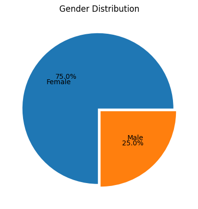

#### Analysis from above chart

1. The survey exhibits a higher participation rate among women, which may introduce a potential gender bias in the resulting analysis.

```python
plt.figure(figsize=(4,4))
plt.title('Age Distribution')
plt.bar(x=working_data['age'].value_counts().index, height=working_data['age'].value_counts().values)
plt.show()
```

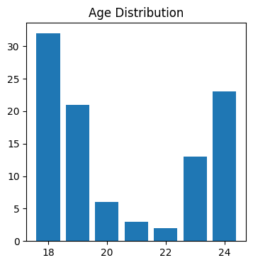

```python
plt.figure(figsize=(4,4))
plt.title('Age Distribution')
plt.bar(x=working_data['current_year'].value_counts().index.tolist(), height=working_data['current_year'].value_counts().values.tolist())
plt.show()
```

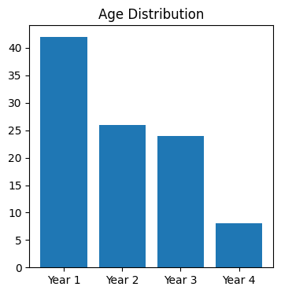

### Analysis from above chart

2. The survey predominantly includes college freshmen, who are primarily aged 18 and 19, which may introduce a potential bias towards the experiences and perspectives of this specific group.

```python
fig, axis = plt.subplots(2,2, figsize=(12,12))
fig.suptitle("Course Distribution across Student Cohorts",fontweight="bold", size=12)

current_year_list = sorted(working_data['current_year'].unique().tolist())

counter = 0

for i in range(2):
    for j in range(2):
        x = working_data[working_data['current_year'] == current_year_list[i]].groupby('course')['gender'].count().sort_values(ascending=False).head().index.to_list()
        y = working_data[working_data['current_year'] == current_year_list[i]].groupby('course')['gender'].count().sort_values(ascending=False).head().values.tolist()
        axis[i,j].bar(x, y)
        axis[i,j].set_title(current_year_list[counter])
        axis[i,j].set_xticklabels(x, rotation=20)

        counter += 1

```

    /var/folders/n4/669_syrx0qzf2gktz416h1d00000gn/T/ipykernel_12231/3018482063.py:14: UserWarning: FixedFormatter should only be used together with FixedLocator
      axis[i,j].set_xticklabels(x, rotation=20)
    /var/folders/n4/669_syrx0qzf2gktz416h1d00000gn/T/ipykernel_12231/3018482063.py:14: UserWarning: FixedFormatter should only be used together with FixedLocator
      axis[i,j].set_xticklabels(x, rotation=20)
    /var/folders/n4/669_syrx0qzf2gktz416h1d00000gn/T/ipykernel_12231/3018482063.py:14: UserWarning: FixedFormatter should only be used together with FixedLocator
      axis[i,j].set_xticklabels(x, rotation=20)
    /var/folders/n4/669_syrx0qzf2gktz416h1d00000gn/T/ipykernel_12231/3018482063.py:14: UserWarning: FixedFormatter should only be used together with FixedLocator
      axis[i,j].set_xticklabels(x, rotation=20)

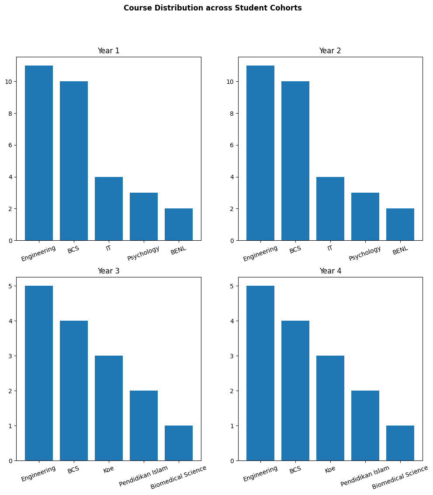

```python
working_data[working_data['current_year'] == current_year_list[i]].groupby('course')['gender'].count().sort_values(ascending=False).head().index.to_list()
```

    ['Engineering', 'BCS', 'Koe', 'Pendidikan Islam', 'Biomedical Science']

```python
x = working_data.groupby('course')['gender'].count().sort_values(ascending=False).head().index.to_list()
y = working_data.groupby('course')['gender'].count().sort_values(ascending=False).head().values.tolist()
plt.title("Course Distribution across Student Cohorts")
plt.bar(x, y)
plt.show()
```

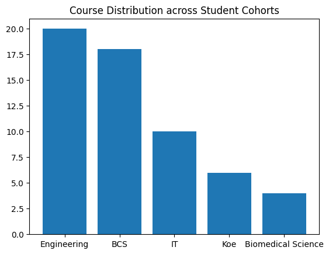

### Analysis from above chart

3. The survey primarily focuses on the participation of students studying Engineering and Computer Science disciplines, which may result in a potential bias towards the perspectives and experiences of individuals within these fields.

```python
sns.catplot(data=working_data, x="current_year", hue='has_anxity', kind="count")\
    .set(title="Mental Health and Academic Years in College: Anxiety", \
        xlabel='Current Year',\
        ylabel='Count of Students')
```

    <seaborn.axisgrid.FacetGrid at 0x7ff15070e6e0>

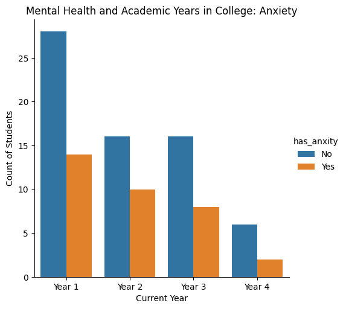

### Analysis from above chart

4. Analyzing Anxiety Levels among College Students: A Majority with No Reported Symptoms.

```python
sns.catplot(data=working_data, x="current_year", hue='has_depression', kind="count")\
    .set(title="Mental Health and Academic Years in College: Depression", \
        xlabel='Current Year',\
        ylabel='Count of Students')
```

    <seaborn.axisgrid.FacetGrid at 0x7ff14eea2890>

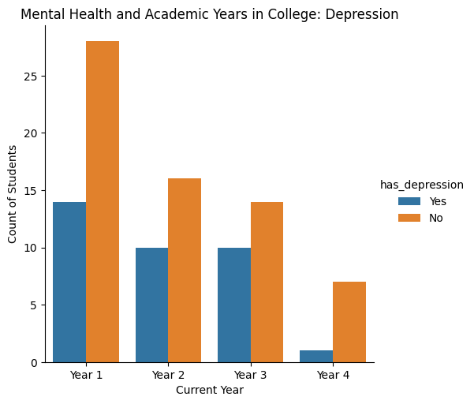

### Analysis from above chart

5. Examining Depression Rates among College Students: Majority Reporting No Symptoms

```python
sns.catplot(data=working_data, x="current_year", hue='has_panic_attack', kind="count")\
    .set(title="Mental Health and Academic Years in College: Panic Attack", \
        xlabel='Current Year',\
        ylabel='Count of Students')
```

    <seaborn.axisgrid.FacetGrid at 0x7ff1506c4f40>

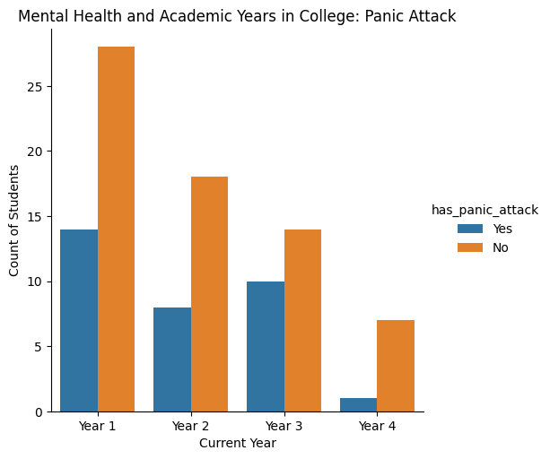

### Analysis from above chart

6. Exploring the Prevalence of Panic Attacks among College Students: Majority Reporting No Incidents

```python
sns.catplot(data=working_data, x="age", hue='has_panic_attack', kind="count")\
    .set(title="The Impact of Age on Panic Attack", \
        xlabel='Age',\
        ylabel='Count of Students')
```

    <seaborn.axisgrid.FacetGrid at 0x7ff155495450>

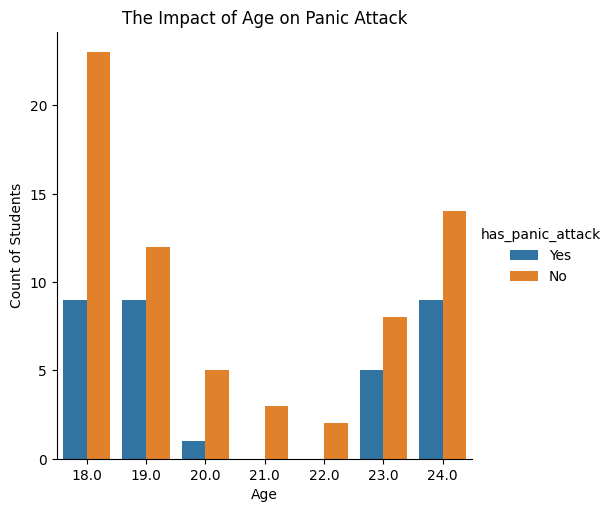

### Analysis from above chart

7. Exploring the Prevalence of Panic Attacks among College Students: Majority Reporting No Incidents

```python
sns.catplot(data=working_data, x="age", hue='has_anxity', kind="count")\
    .set(title="The Impact of Age on Anxity", \
        xlabel='Age',\
        ylabel='Count of Students')
```

    <seaborn.axisgrid.FacetGrid at 0x7ff15266e530>

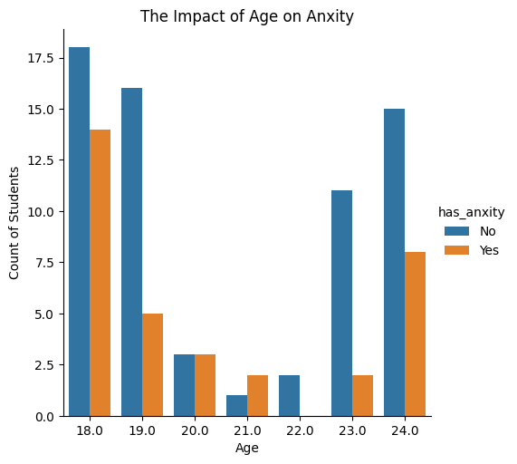

### Analysis from above chart

8. Examining Anxiety Levels among College Students: Majority Report No Symptoms

```python
sns.catplot(data=working_data, x="age", hue='has_depression', kind="count")\
    .set(title="The Impact of Age on Anxity", \
        xlabel='Age',\
        ylabel='Count of Students')
```

    <seaborn.axisgrid.FacetGrid at 0x7ff154592c20>

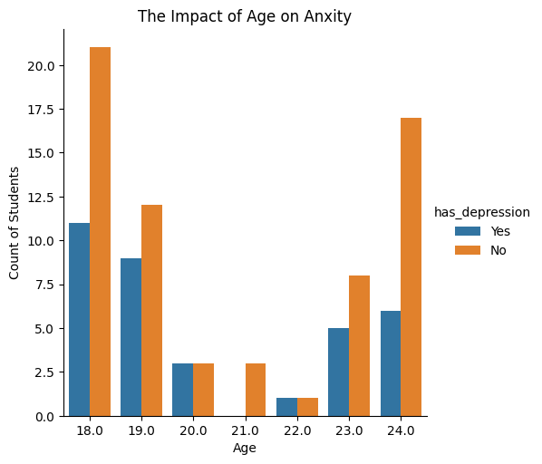

### Analysis from above chart

10. Depression Prevalence among College Students: Majority Report No Symptoms

```python
print('has_depression')
print(working_data[working_data['has_depression'] == 'Yes']['has_anxity'].value_counts())
print('\nno_depression')
print(working_data[working_data['has_depression'] == 'No']['has_anxity'].value_counts())
```

    has_depression
    has_anxity
    Yes    18
    No     17
    Name: count, dtype: int64

    no_depression
    has_anxity
    No     49
    Yes    16
    Name: count, dtype: int64

```python
sns.catplot(data=working_data, x="has_depression", hue='has_anxity', kind="count")
```

    <seaborn.axisgrid.FacetGrid at 0x7ff154575000>

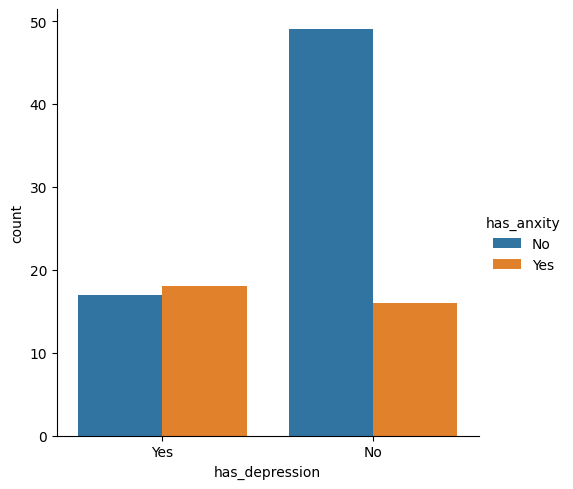

### Analysis from above chart

11. Students with depression have an equal likelihood of experiencing and not experiencing anxiety.
12. Students without depression have a lower probability of having anxiety.
13. The majority of college students neither have anxiety nor depression.
    These points summarize the relationship between anxiety, depression, and college students, highlighting the equal chance of anxiety with depression, a lower chance without depression, and the majority being unaffected by either condition.

```python
sns.catplot(data=working_data, x="has_panic_attack", hue='has_anxity', kind="count")
```

    <seaborn.axisgrid.FacetGrid at 0x7ff15266f130>

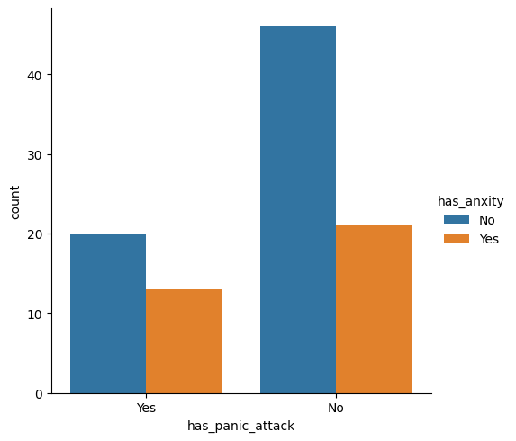

```python
print('has_panic_attack')
print(working_data[working_data['has_panic_attack'] == 'Yes']['has_anxity'].value_counts())
print('\nno_panic_attack')
print(working_data[working_data['has_panic_attack'] == 'No']['has_anxity'].value_counts())
```

    has_panic_attack
    has_anxity
    No     20
    Yes    13
    Name: count, dtype: int64

    no_panic_attack
    has_anxity
    No     46
    Yes    21
    Name: count, dtype: int64

### Analysis from above chart

14. Students who experience panic attacks have a slightly higher than 50% chance of also having anxiety.
15. Students who do not experience panic attacks have a less than 50% chance of having anxiety.
16. The majority of college students neither have anxiety nor panic attacks.

```python
print('has_depression')
print(working_data[working_data['has_depression'] == 'Yes']['has_panic_attack'].value_counts())
print('\nno_depression')
print(working_data[working_data['has_depression'] == 'No']['has_panic_attack'].value_counts())
```

    has_depression
    has_panic_attack
    No     18
    Yes    17
    Name: count, dtype: int64

    no_depression
    has_panic_attack
    No     49
    Yes    16
    Name: count, dtype: int64

```python
sns.catplot(data=working_data, x="has_depression", hue='has_panic_attack', kind="count")
```

    <seaborn.axisgrid.FacetGrid at 0x7ff1545903a0>

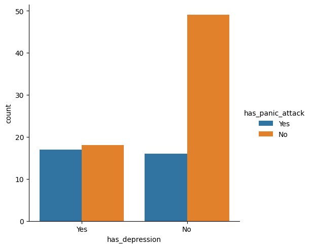

### Analysis from above chart

17. Students with depression have an equal likelihood of experiencing and not experiencing panic attacks.
18. Students without depression have a lower probability of having panic attacks.
19. The majority of college students neither have depression nor panic attacks.

```python
fig, axis = plt.subplots(1,3, figsize=(10, 6))
fig.suptitle("Anxiety, Depression, Panic Attacks, and Doctor Visits: A Comparative Analysis",fontweight="bold", size=12)

column_list = ['has_anxity', 'has_depression', 'has_panic_attack']

for i in range(len(column_list)):
    x = working_data[working_data[column_list[i]] == 'Yes']['visited_specialist'].value_counts().index.tolist()
    y = working_data[working_data[column_list[i]] == 'Yes']['visited_specialist'].value_counts().values.tolist()
    axis[i].bar(x, y)
    axis[i].set_xlabel(column_list[i])

```

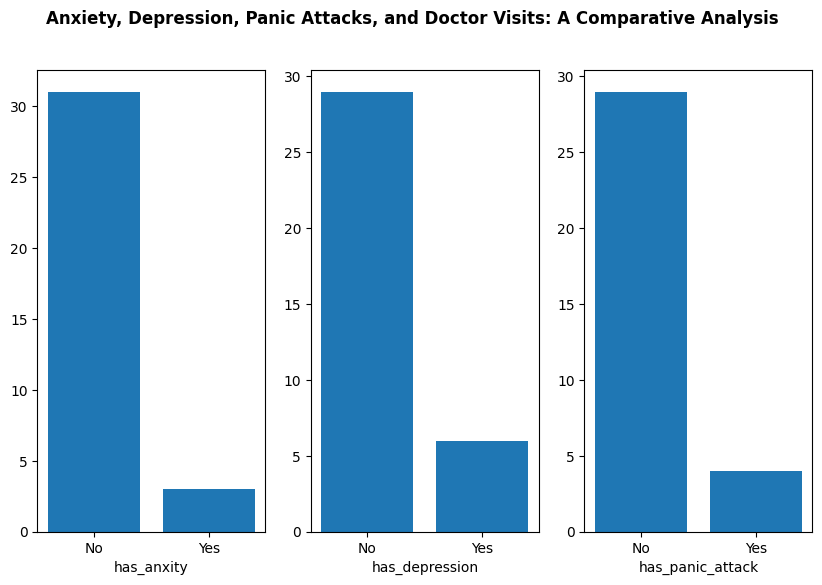

```python

```

```python

```
